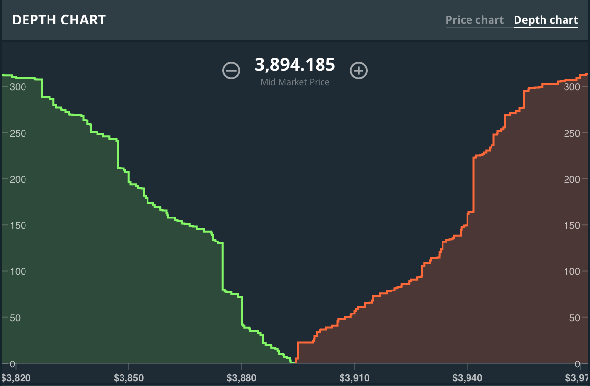

# What is Polyswap?

Polyswap is a permissionless peer-to-peer protocol for decentralized finance (DeFi) implemented on the Cardano proof-of-stake blockchain. Polyswap makes it possible for traders to exchange tokens, while allowing liquidity providers to earn a return on their capital from transaction fees.

## Traditional order-book exchanges

In a traditional order-book exchange, a centralized system receives and matches users' _buy_ and _sell_ orders while taking transaction fees. Users need to entrust their capital with either the exchange itself or an intermediary such as a broker (which might charge additional transaction fees).

At every step of the process, from deposit to withdrawal, the users' capital is in the custody of some party other than themselves. The user needs to trust the broker and/or the exchange, and they, in turn, need to trust the user. As a result, registration is often lengthy and bureaucratic, and whether someone is even allowed to register depends on a number of factors such as their location, citizenship, wealth, and age.

Exchanges often employ market makers to increase liquidity. A market maker is traditionally a company that takes on the obligation of making the other side of trades under certain conditions. Market makers are often granted various informational and trade execution advantages with the exchange but they primarily make money on the bid-ask spread.

For example, if an asset is traded around $1.00 a trivially simple market maker can _buy_ the asset at or below $0.90 and _sell_ at or above $1.10. As long as the market price fluctuates higher and lower than that range, they will be buying assets at $0.90 and selling at $1.10, and their strategy will be profitable. If the price changes substantially, the market maker may want to update their strategy, and If they don't have enough capital they can incur losses. Generally, market makers prefer high-volume, low-volatility markets for that reason.

## What makes Polyswap different

Polyswap implements a noncustodial automated market maker, which is an algorithm that programmatically and continuously determines a price relationship between assets. There is no order book and no _buy_ or _sell_ orders. Trades are always executed at the market price, and the market price changes accordingly. The capital needed to make the markets (i.e. to take the other side of trades every time) can be provided by anyone, and reclaimed at any time. Those who provide capital are known as liquidity providers (LPs), and they earn transaction fees.

Polyswap is permissionless, meaning it is entirely open for public use, with no ability to selectively restrict who can or cannot use the protocol. Anyone can trade, provide liquidity, or create new markets at will.
